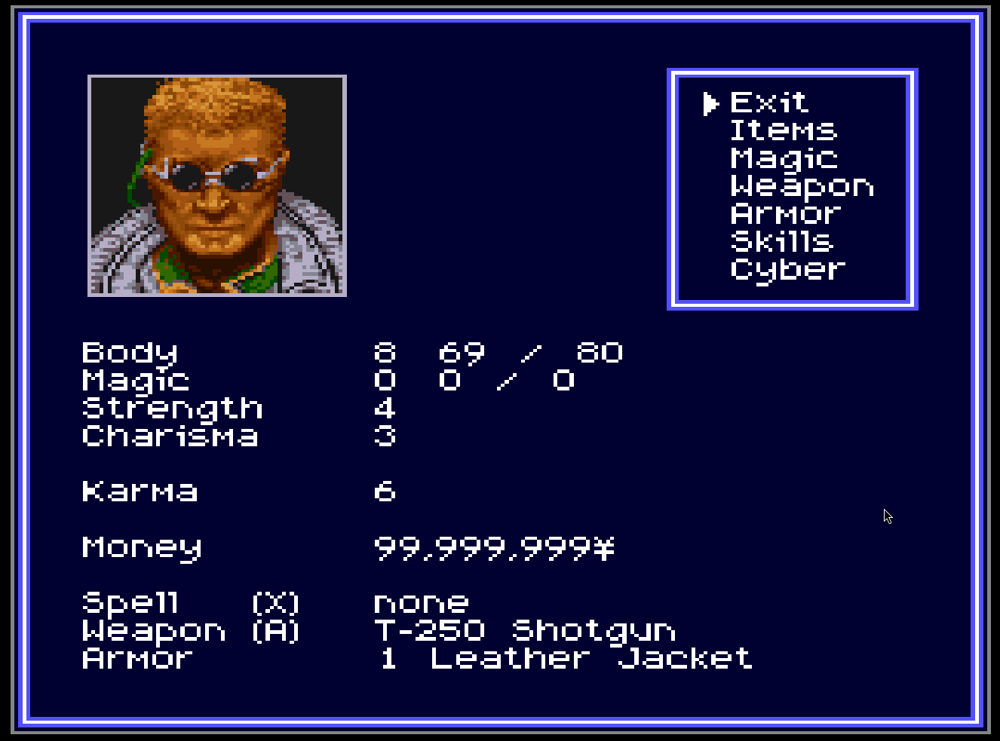
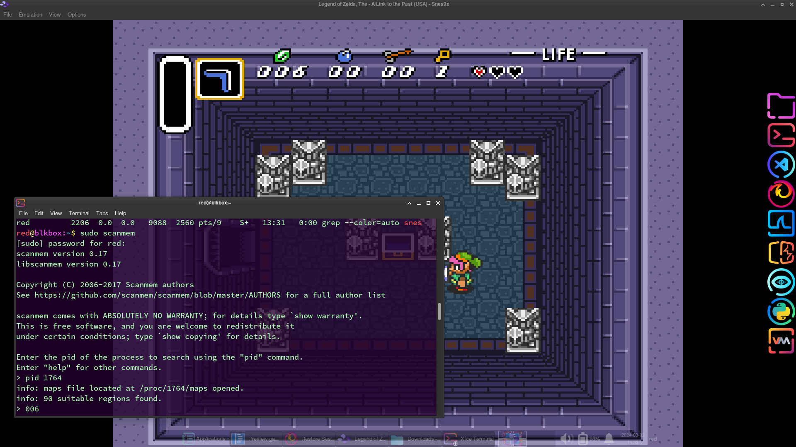
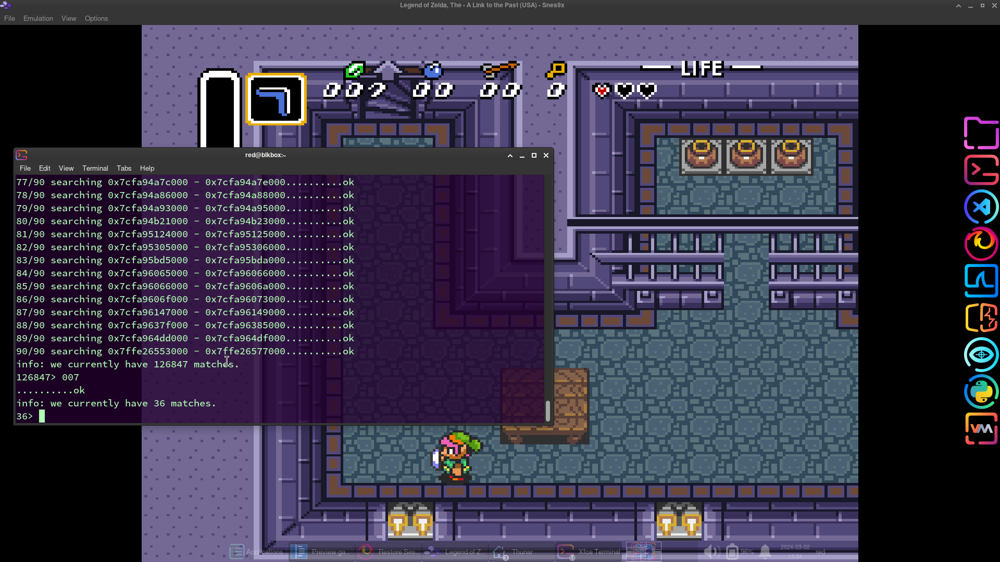
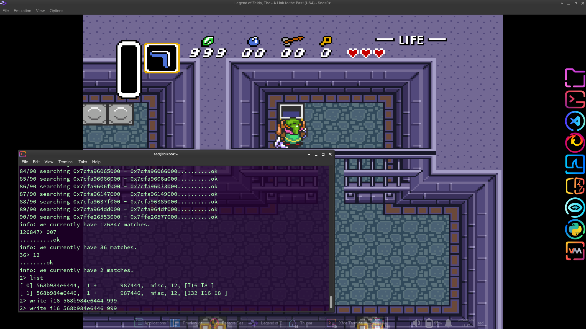
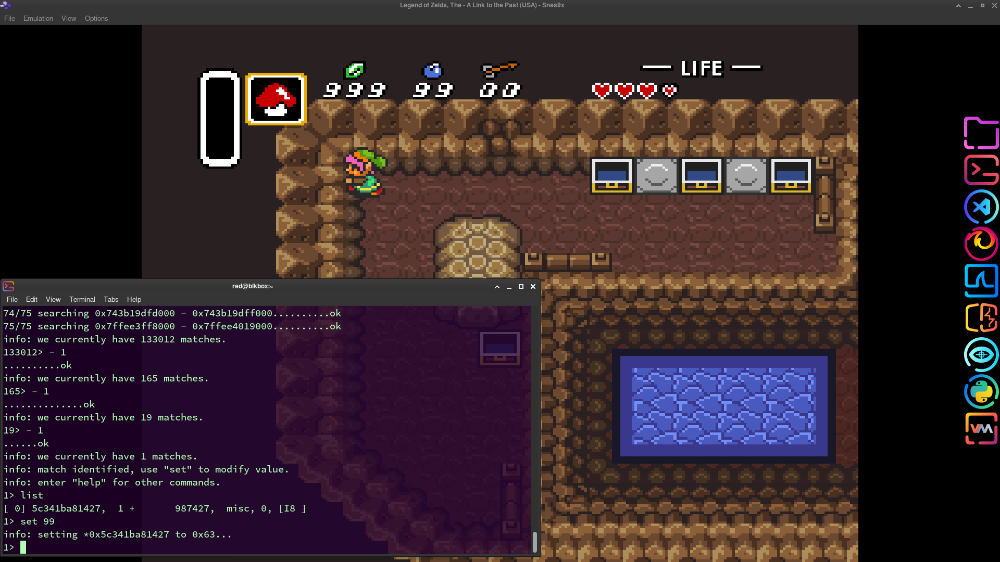
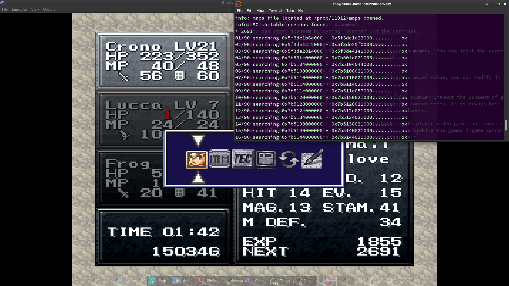
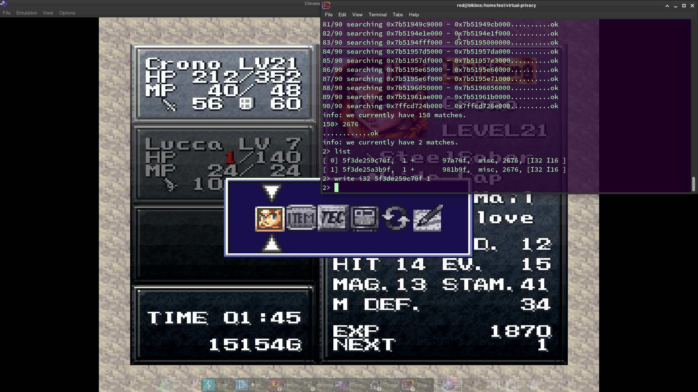
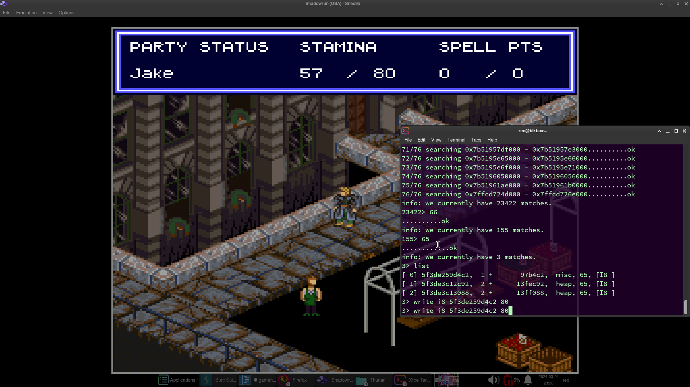

# Hacking The SNES Stack For Fun And (in-game) Profit



<center><sup>Armitage wants your clothes, boots, and motorcyle. Don't worry, he can pay.</sup></center>

---

## Introduction

In this article, I'm going to show you how to hack SNES games for fun and in-game profit (rupees, nuyen, gold, etc). I will be using a laptop running Arch linux to demonstrate, but you can apply the same concepts to hacking any single player game on any platform, provided you have the necessary tools.

---

## Index

1) [Prerequisites](#prerequisites)
2) [Gearing up: A 13 year old's dream in 1993](#gearing-up)
3) [sudo scanmem](#scanmem)
4) [Thinking About Thoughts](#thinking-about-thoughts)
5) [Capturing a Thought - scanmem](#capturing-a-thought)
6) [Differential Analysis as it Applies to Hacking Games](#differential-analysis-as-it-applies-to-hacking-games)
6) [How to Hack Games in 4 Steps](#how-to-hack-games-in-four-steps)
7) [Example Hacks](#the-hack)
8) [Saving an Address](#saving-an-address)
9) [Why I Want to be a Reverse Engineer and You Should Too](#why-i-want-to-be-a-reverse-engineer-and-you-should-too)


---

## Prerequisites 

I am using Arch Linux, so the example commands in this article will be Arch Linux specific in some cases. It's the best Linux repo (IMO). You should be able to easily find versions of the same software in the package manager for the Linux distrubtion that you use. If you use Windows or OSX, I suggest that this is a wonderful time to switch to Linux! 

Jokes aside, you can install Snes9x on Windows & Mac, and the roms will work on any platform. So you can at least get every SNES game for free.

The only other prerequisite is that you are mildly comfortable working in Bash shell.


---


## Gearing up

1) [To hack SNES games you need a SNES](#to-hack-snes-games-you-will-need-a-snes)
2) [Now you need all of the best SNES games](#now-you-need-all-of-the-best-snes-games)
3) [My favorite SNES games circa 1997](#links-to-some-of-the-most-popular-snes-roms-on-myrient)


---


### To hack SNES games you will need a SNES:

Unfortunately, collecting SNES consoles and games is to retro gaming collections what cryptocurrency is to financial portfolios. 

Lets use an open source alternative instead: [Snes9x](https://www.snes9x.com/) 

Instal Snes9x on Arch:

```bash
sudo pacman -S snes9x-gtk
```


---


### Now you need all of the best SNES games:

If only there was a safe repository of high quality classic SNES games for free...

[Myrient](https://myrient.erista.me/files/No-Intro/Nintendo%20-%20Super%20Nintendo%20Entertainment%20System/) was created to preserve ad-free and malware-free retro games. Myrient is maintained by a group of dedicated technology archivists who want to preserve retro games as part of our digital heritage. 

The initial motivation for the Myrient project came from the authors shared feeling that incredible games were becoming extinct:

> Myrient is a portmanteau of the words "myriad" and "entertainment", referring to the countless amount of video game content that is difficult to access or no longer available legitimately.

#### Note: You do not need to unzip roms from Myrient, just open them with Snes9x.

#### Now show your support for the Myriad project by downloading every SNES game you ever wanted!


---


### Links to some of the most popular SNES roms on Myrient:
- [Shadownrun](https://myrient.erista.me/files/No-Intro/Nintendo%20-%20Super%20Nintendo%20Entertainment%20System/Shadowrun%20%28USA%29.zip)
- [Zelda - A Link to the Past](https://myrient.erista.me/files/No-Intro/Nintendo%20-%20Super%20Nintendo%20Entertainment%20System/Legend%20of%20Zelda%2C%20The%20-%20A%20Link%20to%20the%20Past%20%28USA%29.zip)
- [NBA Jam](https://myrient.erista.me/files/No-Intro/Nintendo%20-%20Super%20Nintendo%20Entertainment%20System/NBA%20Jam%20%28USA%29%20%28Rev%201%29.zip)
- [Harvest Moon](https://myrient.erista.me/files/No-Intro/Nintendo%20-%20Super%20Nintendo%20Entertainment%20System/Harvest%20Moon%20%28USA%29.zip)
- [Super Star Wars](https://myrient.erista.me/files/No-Intro/Nintendo%20-%20Super%20Nintendo%20Entertainment%20System/Super%20Star%20Wars%20%28USA%29%20%28Rev%201%29.zip)
- [Super Star Wars - The Empire Strikes Back](https://myrient.erista.me/files/No-Intro/Nintendo%20-%20Super%20Nintendo%20Entertainment%20System/Super%20Star%20Wars%20-%20The%20Empire%20Strikes%20Back%20%28USA%29%20%28Rev%201%29.zip)
- [Super Star Wars - Return of the Jedi](https://myrient.erista.me/files/No-Intro/Nintendo%20-%20Super%20Nintendo%20Entertainment%20System/Super%20Star%20Wars%20-%20Return%20of%20the%20Jedi%20%28USA%29%20%28Rev%201%29.zip)
- [Chrono Trigger](https://myrient.erista.me/files/No-Intro/Nintendo%20-%20Super%20Nintendo%20Entertainment%20System/Chrono%20Trigger%20%28USA%29.zip)
- [Secret of Mana](https://myrient.erista.me/files/No-Intro/Nintendo%20-%20Super%20Nintendo%20Entertainment%20System/Secret%20of%20Mana%20%28USA%29.zip)
- [Trials of Mana](https://myrient.erista.me/files/No-Intro/Nintendo%20-%20Super%20Nintendo%20Entertainment%20System/Trials%20of%20Mana%20%28World%29%20%28Collection%20of%20Mana%29.zip)
- [Battletoads](https://myrient.erista.me/files/No-Intro/Nintendo%20-%20Super%20Nintendo%20Entertainment%20System/Battletoads%20in%20Battlemaniacs%20%28USA%29.zip)
- [Super Street Fighter II](https://myrient.erista.me/files/No-Intro/Nintendo%20-%20Super%20Nintendo%20Entertainment%20System/Super%20Street%20Fighter%20II%20%28USA%29%20%28Rev%201%29.zip)
- [Super Metroid](https://myrient.erista.me/files/No-Intro/Nintendo%20-%20Super%20Nintendo%20Entertainment%20System/Super%20Metroid%20%28USA%2C%20Europe%29%20%28En%2CJa%29%20%28Virtual%20Console%2C%20Classic%20Mini%2C%20Switch%20Online%29.zip)
- [Super Mario World](https://myrient.erista.me/files/No-Intro/Nintendo%20-%20Super%20Nintendo%20Entertainment%20System/Super%20Mario%20World%20%28USA%29.zip)
- [Super Mario World 2 - Yoshi's Island](https://myrient.erista.me/files/No-Intro/Nintendo%20-%20Super%20Nintendo%20Entertainment%20System/Super%20Mario%20World%202%20-%20Yoshi%27s%20Island%20%28USA%29%20%28Rev%201%29.zip)
- [Super Mario Kart](https://myrient.erista.me/files/No-Intro/Nintendo%20-%20Super%20Nintendo%20Entertainment%20System/Super%20Mario%20Kart%20%28USA%29.zip)
- [Super Mario RPG](https://myrient.erista.me/files/No-Intro/Nintendo%20-%20Super%20Nintendo%20Entertainment%20System/Super%20Mario%20World%20%28USA%29.zip)
- [SimCity](https://myrient.erista.me/files/No-Intro/Nintendo%20-%20Super%20Nintendo%20Entertainment%20System/SimCity%20%28USA%29.zip) 
- [Contra III - The Alien Wars](https://myrient.erista.me/files/No-Intro/Nintendo%20-%20Super%20Nintendo%20Entertainment%20System/Contra%20III%20-%20The%20Alien%20Wars%20%28USA%29.zip)
- [Mortal Kombat](https://myrient.erista.me/files/No-Intro/Nintendo%20-%20Super%20Nintendo%20Entertainment%20System/Mortal%20Kombat%20%28USA%29%20%28Rev%201%29.zip)
- [Mortal Kombat II](https://myrient.erista.me/files/No-Intro/Nintendo%20-%20Super%20Nintendo%20Entertainment%20System/Mortal%20Kombat%20II%20%28USA%29%20%28Rev%201%29.zip)
- [Mortal Kombat III](https://myrient.erista.me/files/No-Intro/Nintendo%20-%20Super%20Nintendo%20Entertainment%20System/Mortal%20Kombat%203%20%28USA%29.zip)


---


## scanmem


Scanmem is a tool for scanning and editing values in memory. It's an Open Source tool available in the main repository of most Linux distributions.

To install scanmem on Arch Linux:

```bash
sudo pacman -S scanmem
```

To learn how to use scanmem in detail check the manual:

```bash
man scanmem
```

Github repo: [scanmem](https://github.com/scanmem/scanmem)

Scanmem also has an affiliated GUI based tool, GameConqueror, but I've never used it so I can't speak for it's effectiveness.


---


## Thinking About Thoughts

#### Human Memory, Natures HD

When a human performs a process, they are by necessity thinking. We may employ experience, which is the memory of performing that process previously. However, performing an action requires active thought, and cannot be accomplished through recollection alone.

Computers operate in the same manner. Data stored on the hard disk cannot be used to perform a dynamic action. You cannot execute data stored on disk, in the same manner in which we cannot drive a car by only employing a memory of driving a car in the past. We need to physically operate the vehicle, which requires our minds to think about what we are doing actively. I.e. remembering stepping on a break pedal, won't prevent you from rear ending someone stopped infront of you.

Memory as it relates to humans is the data that has been written to a computer's hard disk or SSD. Data that has been written to disk can only be read or overwritten, remaining static otherwise.

---

#### Two roads diverged in a yellow wood

Create two distinctions for yourself: 
1) Memory as it pertains to humans equates to data that has been written to disk for computers.
2) Thoughts as they pertain to a human are called memory for a computer.

A computer stores its thoughts within random access memory (memory). When a computer reads data from a disk into memory, the computer is converting memories into a collection of actionable thoughts - a process.

On a technical level, a process is a unit of work that is being executed or managed by the operating system. The process consists of the program's code and data, as well as any additional resources for the program to run successfully. 

Each process has its own space in the computer's memory, execution state, and system resources, which are allocated to processes by the operating system. Processes allow the computer to multitask, running multiple programs concurrently, managing the execution of each program.

**If we can locate the space assingned to a process in memory, we can start hunting for values that are of interest to us associated with that process.**

---

## Capturing a Thought

Albeit largely a topic for science fiction (or Neuralink) for humans, to rewrite a computer's memory is a trivial task. If we can locate a value we are interested in within the computer's memory, we can simply put a new value in its place.


#### First, run Snes9x:

```bash
snes9x-gtk
```

#### Next, locate Snes9x's process identification number (PID).

To locate a running process on Linux we can use `ps`. We can pipe the results of `ps` to `grep` and immediately figure out Snes9x process identification number (PID). 

```bash
ps aux | grep snes
```

##### An example output:

```bash
red         5703 25.8  0.5 1319752 205956 pts/1  SLl+ 17:06   0:00 snes9x-gtk
red         5730  0.0  0.0   9088  2432 pts/0    S+   17:06   0:00 grep --color=auto snes
```

- The first line of output is Snes9x process information. 
- The first numeric value on the first line is the PID for Snes9x.
- The second line of output is the process information for `grep`.

**In the example, the PID for snes9x-gtk is: 5703**


---

## Differential Analysis as it Applies to Hacking Games

Differential analysis is a technique used in computer programming to compare the differences between memory snapshots taken at different points in time. This technique is commonly employed in debugging and forensic analysis to locate specific values stored in memory that are associated with a particular PID.

---

#### In the case of video game hacking, we can use differential analysis to isolate values that we want to change. 

The difficulty of isolating the value in memory is proprtional to the length of known values in bits. For example, finding the value 532,128 would be significantly easier than 1. 

A computer can convey the integer 1 in a single bit, whereas the number 532,128 requires 20 bits to represent. 

Finding the integers [5, 3, 2, 1, 2, 8] in order in a program's memory space is definitely possible, but the odds of finding a single integer, 1, within the program's memory is astronomically greater. 

---

#### From the standpoint of probability: 
- The chance of 1 being the value of a random integer (0-9) is 1 / 10.
- The chance of 542128 appearing in order in a series of 6 random integers is 1 / 10<sup>6</sup> or 1 / 1,000,000.

---

#### No more math:
My point isn't that you need to manually calculate probabilities to perform differential analysis, because it absolutely doesn't. 

It's also worth pointing out that values stored in a games buffers are probably not random values. 

My intention is to illustrate the fact that a more complex number is an easier needle to find in a haystack.

---

#### Time to hack games and chew bubble gum...


---


## How to Hack Games in Four Steps
1) We identify a value we want to edit.
2) We identify the location of our program in the computer's memory.
3) We use differential analysis to locate the value's address in memory.
4) We overwrite the value stored at that address with a new value.


---


## Sharing Hacks

Although the address in memory won't be valuable to other hackers, if you have successfully identified a method that can accurately obtain a hard to locate address, please share it with me! 

Mark down the steps you took, and it should be trivial to repeat the process. 


---


## Example Hacks

1) [Unlimited Rupees in Zelda](#unlimited-rupees-in-zelda)
2) [Unlimited Bombs & Arrows in Zelda](#unlimited-bombs-and-arrows-in-zelda)
3) [Super Fast Leveling in Chrono Trigger](#super-fast-leveling-in-chrono-trigger)
4) [Saving an Address](#saving-an-address)
5) [Hacking non-numeric HP/MP Bars](#dealing-with-mana-and-life-point-bars)

---

## Unlimited Rupees in Zelda

In this example, I'm going to provide a literal value as the parameter that scanmem will use to search for matches. 

For example, Link starts with 006 rupees, so I will provide scanmem with 006 as my parameter.

At a binary level, this value tells scanmem to look for patterns of bits matching 0000000100. 

**Note:** If you only provide the integer 6, you are telling scanmem to match patterns of bits matching 100. 

As discussed [previously](#differential-analysis-as-it-applies-to-hacking-games), this will return a signicantly greater number of matches than 006.

#### Give me the Loot:
1) Run Snes9x and load a game. 
2) Identify an in-game value that you want to change.
3) Identify the current PID of Snes9x:
    - `ps aux | grep snes`
4) Run scanmem as root:
    - `sudo scanmem`
5) Attach scanmem to Snes9x (example PID: 1764):
    - `pid 1764`
6) Search for matches containing the value you identified (example: 006):
    - `006`
7) You find 126,847 matches.
8) Return to the game and cause the value to change manually.
9) Return to the terminal running scanmem and input the updated value (example: 007):
    - `007`
10) You are left with 36 matches:
11) Return to the game and manually cause the value to change.
12) Return to the terminal running scanmem and input the updated value (example: 012):
    - `012`
13) You are left with two matches
14) Writing to the first buffer causes the rupees to count up on the screen sequentially, but does not have a permanent effect on the total number of rupees in the players inventory.
    - `write i16 568b984e6444 999`
15) Writing to the second buffer changes the number of rupees in Links inventory to the desired number permanently.
    - `write i16 568b984e6444 999`
- Congratulations, you have 999 rupees.

#### Identify the value you want to change:

#### Search for the identified value with scanmem, then manually update the value in game:

#### After narrowing down your matches, test the effect of writing new values to the addresses you have isolated:

#### 999 Rupees, but a bomb ain't one!

---


## Unlimited Bombs and Arrows in Zelda

Because life is more fun with explosives and projectiles.

In this example we will use a slightly different strategy for locating our address. 

We know that in Zelda the maximum number of bombs or arrows a player can have at any given time is 99. 


We will tell `scanmem` to look for a specific value. For further searches, we will tell `scanmem` to look for values that have depleted by a specific amount since our previous snapshot.

#### Getting down to hacking:
1) While playing the Legend of Zelda - A Link to the Past (Zelda):
    - `snes9x-gtk`
2) You look up Snes9x's PID.
    - `ps aux | grep snes`
3) You run scanmem as root.
    - `sudo scanmem`
4) You input Snes9x's PID into scanmem.
    - `pid 1337`
5) You know that the maximum bombs a player can have at one time is 99.
6) You currently have 11 bombs.
7) You instruct scanmem the memory allocated to Zelda for values that match 11. 
    - `11`
8) You find 133,012 values in the games segment of memory that match 11. 
9) You place a bomb. You now have 10 bombs.
10) You instruct scanmem to search for matches reduced by 1 since the last snapshot.
    - `- 1`
11) Scanmem returns 165 matches. 
12) You place a bomb. You now have 09  bombs.
13) You repeat the process and receive 1 match.
    - `- 1`
14) Now you have 99 bombs.
    - `set 99`
15) The same process works for arrows!

#### Steps 8 through 14:


---

## Super Fast Leveling in Chrono Trigger
I would immediately ask: "Why not immediate leveling?" 

To explore the answer, see: [Why I Want to be a Reverse Engineer, and You Should Too](#why-i-want-to-be-a-reverse-engineer-and-you-should-too)


#### Returning to Chrono Trigger:
In Chrono Trigger, raising a character's experience has no effect on their level. This has to do with the programmatic choices that were made when Chrono Trigger was developed. 

Chrono Trigger has an additional stat that dictates the amount of experience required to reach the next level. That variable is the target for the hack.


#### To Level Super Fast in Chrono Trigger:
1) Run Snes9x and load the rom:
    - `snes9x-gtk`
2) Find Snes9x PID:
    - `ps aux | grep snes`
3) Run scanmem as root:
    - `sudo scanmem`
4) Point scanmem towards Chrono Trigger's PID (example PID: 1337):
    - `pid 1337`
5) In Chrono Trigger, navigate to the desired characters stats page.
6) Locate the value NEXT at the bottom right corner of the character sheet.
7) Input the value associated with NEXT into scanmem (example NEXT: 1337):
    - `1337`
8) In Chrono Trigger, locate the nearest bad guy, and provide a swift end.
9) Return to the selected characters stats page to retrieve the value for NEXT, which changed by the number of experience points you received for defeating your foe (example NEXT: 1234)
10) Input the new value for NEXT into scanmem:
    - `1234`
    - Scanmem will check which matches from the previous snapshot match the new value.
    - The variable is an integer that is is larger than 8 bits (easy).
2) Set that value to 1 and then kill any monster.
    - Setting the value to 1 makes the next monster you kill provide trigger the game's condition for your character to level up.
3) Wax & repeat until surface coat is shiny without blemishes.

This tells the game that the next time Chrono receives experience to trigger a level up.

#### Searching for values matching 2691:

#### Narrowing it down and finding the correct address:


---


## Saving an Address
If you have successfully altered a desired value, you can record the address so that you can alter it again. Otherwise you will have to repeat the entire process if you want to edit multiple values at the same time. Alternatively you could run multiple instances of scanmem in different terminals. 

---

#### Regarding the longevity of saved addresses:
- The addresses you discovered will only be valid while Snes9x is left running. 
- If you close & reopen Snes9x, the process will be alotted a new space in the computer's memory. 
- The stored addresses will point to a location in the memory that does not pertain to the current instance of the program.

---

#### Demonstrating scanmem's write function
In the following example from hacking Shadowrun, I have identified the address containg the value associated with Armitage's hit points. I use scanmem's write command to set a value for the hit points, rather than using the set command, which would change the value for all 3 matches:

```bash
............ok
info: we currently have 3 matches.
3> list
[ 0] 5f3de259d4c2,  1 +       97b4c2,  misc, 65, [I8 ]
[ 1] 5f3de3c12c92,  2 +      13fec92,  heap, 65, [I8 ]
[ 2] 5f3de3c13088,  2 +      13ff088,  heap, 65, [I8 ]
3> write i8 5f3de259d4c2 80
```

Provided I don't exit, I can now reuse this write command at an arbitrary point in the future to top up Armitage's hit points. 

The syntax is `write` > followed by the variable's type and length in bytes* > then the address in memory > followed by the base-10 value to place in the buffer. 

Note you can cause a buffer overrun by inputting a value larger than the buffer you are writing to can contain. Causing a buffer overrun will result in scanmem writing null bytes to the address, setting the value to 0 for the purpose of the game.

*The variables type and length in bytes is the final value contained within [] in the bash code snippet above. I8 means integer 8 bits in length.


#### Before writing to the address:



#### After writing to the address:


---


## Dealing with Mana and Life Point Bars

SNES is full of games that have bars representing a players health or magic points pool (hp/mp bars). These would seem obvious targets for the player to hack. I noted that Game Genie didn't contain a hack for Zelda's magic bar, however I was able to change it at my discretion. 

It adds a level of difficulty if you do not have a fixed value to begin your search, but it doesn't add that many additional steps if you can locate some auxiliary information.

For example, in Zelda, Link's magic bar is a fixed value between 0 and 128. The mana cost of various magical actions taken by Link is well documented online. You can tell scanmem to match buffers containing values between 0 and 128. 

You can then use a spell that you know the mana cost of. You can search for buffers that contain values between 0 and 128, of the mana cost to search for numbers that have depleted by that amount, and quickly find what you are looking for.


---


## Why I Want to be a Reverse Engineer and You Should Too

---
#### Tricksy values:

In most cases, the technique of searching for a specific value and changing it will have the desired effect, but sometimes the effects may be surprising even if we have changed the desired value in-game.

For this method of game hacking, we care about how variables are stored in memory. We ant to find them and edit them. But what happens when the value is being used in a function that we don't know about to do something we can't see? 

Sometimes you will run into values that are suspciously difficult to locate in memory regardless of your expertise at applying differential analysis. 

This goes beyond low numbers that are difficult to locate without knowing the length of the buffer they are stored in. 

---

#### Zelda's has multiple addresses for rupees

Zelda has at least two addresses that pertain to the number of rupees displayed on screen. 

Placing a new value in one address causes the number of rupees to count up or down on the display, but after the visual effect is finished you are left with the same number of rupees that you started with. The other value contains the total number of rupees in the player's inventory.

Both numbers change what is displayed on screen, but only one contains logic that can be manipulated to change the number of rupees in the player's inventory permanently. 

---

#### karma

I have personally struggled with editing Shadowrun's Karma value.

My understanding is that karma is relative to a hidden value, experience. I have read that standard enemies typically give between 1-2 experience, and bosses significantly more. It takes 8 experience points to generate 1 karma.

My theory is that Karma is the result of subtracting modulus 8 from the value for experience, and then dividing the result by 8. I have tried to isolate this variable, but without walking through the program with a more sophisticated tool, I haven't been able to crack that puzzle.

That is not to say that I haven't narrowed it down to a single match, because I have multiple times, through different methods. It just seems to have no effect in game. 

It's possible the times I have discovered a single match, it's a random variable with the same value that has undergone the same value changes. Perhaps somewhere a pixel is changing shades imperceptibly with my edits. Regardless, my karma remains the same.

---

#### Enter reverse-engineering

To truly understand these nuances requires a deep dive into the software's underlying mechanics and structure. Walking through a program in memory and being able to reconstruct its operation is what reverse engineers and low-level computing experts do. 

Being able to reverse engineer malware or exploit critical vulnerabilties are some of the most elite skills a hacker can pursue. If script kiddies use other people's tools, and hackers make their own, the reverse engineer is the next step in the evolution.

---

#### Should I commit to learning very difficult things?
If you connect passionately with the following points, the answer is likely yes:
1) The world is full of fascinating problems waiting to be solved.
2) No problem should ever have to be solved twice.
3) Boredom and drudgery are evil
4) Freedom is good.
5) Attitude is no subsitute for competence.

According to Eric S. Raymonds, one of the originators of the open source software movement, these are the fundamental elements of the hacker attitude. When I first read Eric S. Raymonds article, [How to Become a Hacker](), it set me on the path that I wake up excited for every day.

---

#### Where do you learn?

If you are interested in learning how to walk through stack frames, reverse engineer malware, and discover zero-day exploits, I highly recommend that you look into [Open Security Training](https://p.ost2.fyi). 

Knowledge I earned through completing OST courses allowd me to figure out the process I taught you to use in this article in a lot less time than it took me to write it!


